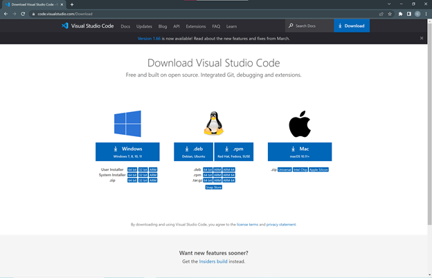

# Week 2 Lab Report

---
## Installing VS Code
To set up VS Code (a programming environment), go to the [download page](https://code.visualstudio.com/download) and click “Download” in the upper right corner. Download VS Code corresponding to your operating system (OS). Additionally, you must have Java downloaded on your computer. To do this, go to this [download page](https://www.oracle.com/java/technologies/downloads/) and download the Java Development Kit (JDK) according to your OS. Download both VS Code and and Java according to the default settings. 

*This is the website to download VS Code.*



*This is the website to download Java.*


*This is what VS Code should look similar to this after you download it.*


---
## Remotely Connecting
Remotely connecting means that you use your device to access connect to a remote computer to work on that device. Make sure you have your user name and your host name. For your course specific account, your host name should be ieng6.ucsd.edu. Your user name will be specific to you and you can find your username on [here](https://sdacs.ucsd.edu/~icc/index.php). In the terminal, type the command `ssh [username]@ieng.ucsd.edu`. Insert your username in the respective place in the command. 

If it is the first time you are connecting, you will see a message saying: 
`Are you sure you want to continue connecting (yes/no/[fingerprint])?`

Type in `yes`. If it is not your first time, then you will **not** see this message. Then enter in your password when prompted to do so. Note that you will not see your password as you are typing it for security reasons.

*Click “Terminal” and then “New Terminal” to open up a terminal on VS Code.*


*When you successful connect to a computer in the CSE basement, your terminal should look similar to this.*


---
## Trying Some Commands
* Now that you have successfully remotely connected, you can try some commands.
* Running the command `ls` in the terminal lists all of the computer files and directories in Linux. 
* Running the command `cd perl5` changes the current working directory. After running the command `ls`, I have a perl5 folder and by running `cd perl5`, I change my directory to this folder. 
* Running the command cd .. changes the directory to the parent folder.

*In this picture, I ran the commands `ls`, `cd perl5`, and `cd ..`*


---
## Moving Files with scp
We are going to try moving files from your computer to the remote computer. Create a Java file on your client called WhereAmI.java with the following contents (code is from Lab 1): 

```
class WhereAmI {
  public static void main(String[] args) {
    System.out.println(System.getProperty("os.name"));
    System.out.println(System.getProperty("user.name"));
    System.out.println(System.getProperty("user.home"));
    System.out.println(System.getProperty("user.dir"));
  }
}
```

*When you run and compile this file, it should look like this. Use the commands `javac WhereAmI.java` and `java WhereAmI` to compile and run this file.*


*In the directory where you created WhereAmI.java, run the command `scp WhereAmI.java [username]@ieng6.ucsd.edu` and replace the username with your username. It will then ask you for a password. It should look similar to this screenshot.*

![In the directory where you created WhereAmI.java, run the command `scp WhereAmI.java [username]@ieng6.ucsd.edu` and replace the username with your username. It will then ask you for a password. It should look similar to this screenshot.](Picture8.png)

*Then log into ieng6 with ssh using the same command from the “Remotely Connecting” section. Then run the command from “Trying Some Commands” to see your file in the home directory on the ieng6 computer. You can also compile and run this file on the server (computer you are accessing).*

 

---
## Setting an SSH Key

**If you *are not* on Windows:**
  On your computer (client), run the command `ssh-keygen`.
  
**If you *are* on Windows:**
  Run the command `ssh-keygen -t ed25519`.
  
Press enter when it asks your for a passphrase as we do not want to enter anything for a passphrase. 
Then log into the server and enter in the command `mkdir .ssh`. 
Back on client, run the command `scp /Users/[user-name]/.ssh/id_rsa.pub [username]@ieng6.ucsd.edu:~/.ssh/authorized_keys`. Replace user-name with your path and username with your log in to access the remote computers.
After this, you should be able to access the server from this client without needing to put in your password.

*No password was necessary.*


---
## Optimizing Remote Running
To optimize remote running, you can write in commands in quotes at the end of the ssh command to run it on the remote server and exit after. To run multiple commands, you can separate then with semicolon. Keep in mind that you can only run commands for the server; you cannot run commands like `scp` on your client as it must be run on the server.

*This picture shows where I compiled and ran WhereAmI.java on the remote server.*


