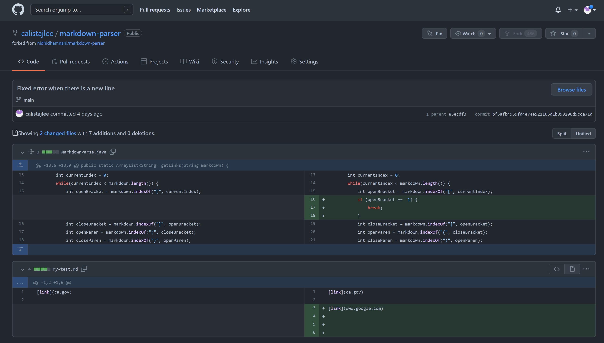
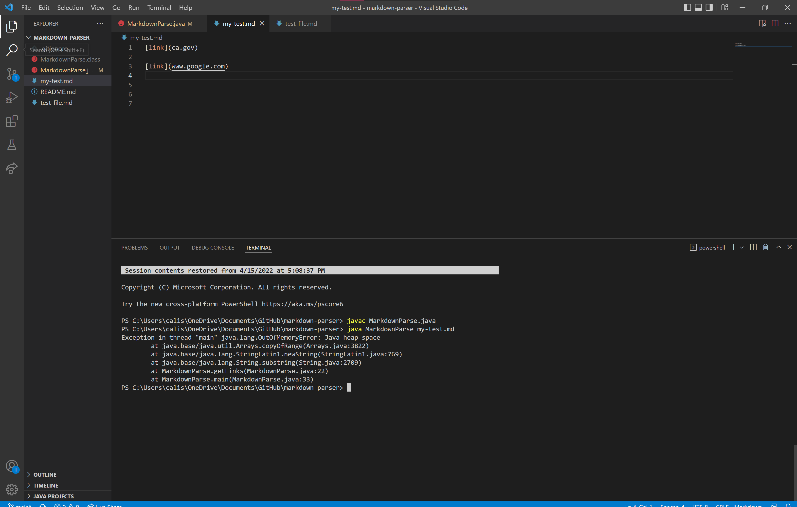

# Week 4 Lab Report

## Change 1

[Link to test file with error](https://github.com/calistajlee/markdown-parser/commit/0929226d3c2b393bf8c64b5c9105412e890d6576) 

The symptom is the faulty program behavior that I can see, which was the out of memory error that I saw when I compiled and ran my code. The failure-inducing input was having a new line after my line of code. The bug is that the program did not account for ignoring new lines that had no code in it.

---
## Change 2

[Link to test file with error](https://github.com/calistajlee/markdown-parser/commit/0929226d3c2b393bf8c64b5c9105412e890d6576) 

The symptom is the faulty program behavior that I can see, which was the out of memory error that I saw when I compiled and ran my code. The failure-inducing input was having a new line after my line of code. The bug is that the program did not account for ignoring new lines that had no code in it.

---
## Change 3

[Link to test file with error](https://github.com/calistajlee/markdown-parser/commit/0929226d3c2b393bf8c64b5c9105412e890d6576) 

The symptom is the faulty program behavior that I can see, which was the out of memory error that I saw when I compiled and ran my code. The failure-inducing input was having a new line after my line of code. The bug is that the program did not account for ignoring new lines that had no code in it.