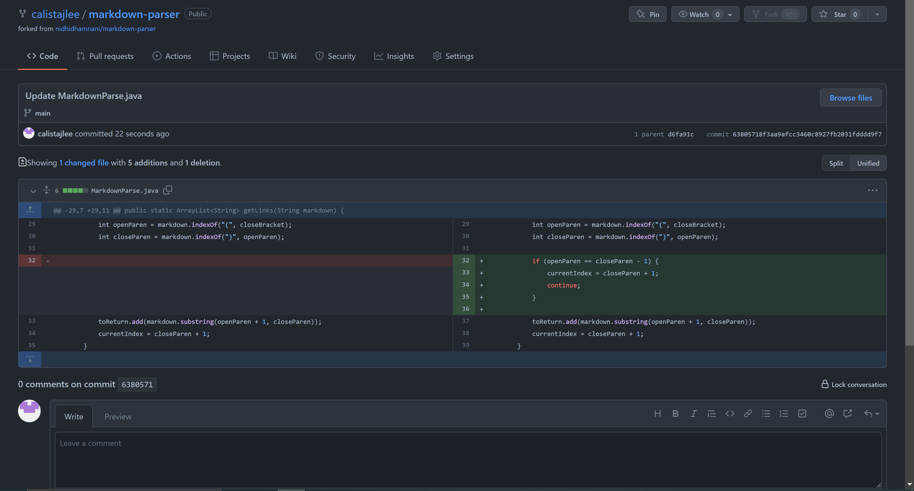
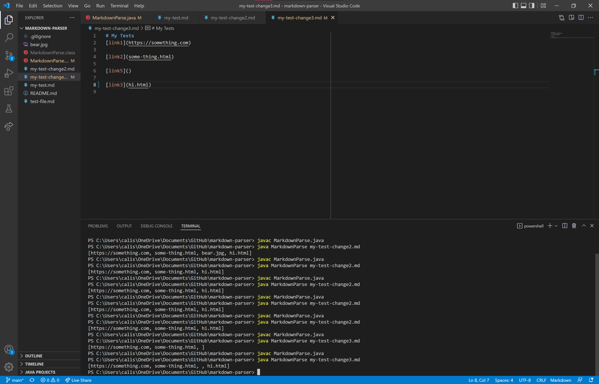

# Week 4 Lab Report

## Change 1
Screenshot of the code change difference from GitHub.

[Link to test file with error](https://github.com/calistajlee/markdown-parser/blob/main/my-test.md) 

Symtom of failure-inducing input

The symptom is the faulty program behavior that I can see, which was the out of memory error that I saw when I compiled and ran my code. The failure-inducing input was having a new line after my line of code. The bug is that the program did not account for ignoring new lines that had no code in it.

---
## Change 2
Screenshot of the code change difference from GitHub.
 

[Link to test file with error](https://github.com/calistajlee/markdown-parser/blob/main/my-test-change2.md) 

The symptom is the faulty program behavior that I can see, which was the program reading the third link even though no link was inputted. The failure-inducing input was running `[link3]()`. The bug is that the program did not account for not having any inputs.

---
## Change 3
Screenshot of the code change difference from GitHub.
 

[Link to test file with error](https://github.com/calistajlee/markdown-parser/blob/main/my-test-change3.md) 

Symtom of failure-inducing input

The symptom is the faulty program behavior that I can see, which was the program reading the third link even though no link was inputted. The failure-inducing input was running `[link3]()`. The bug is that the program did not account for not having any inputs.
