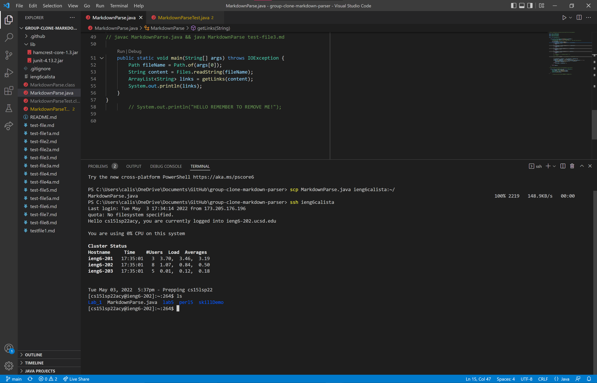

# Week 6 Lab Report

## Streamlining ssh Configuration
**Show your .ssh/config file, and how you edited it (with VScode, another program, etc)**

I edited my `.ssh/config` file using Notepad.

**Show the `ssh` command logging you into your account using just the alias you chose.**
 
I logged into my account using `ssh ieng6calista`, which is my alias that I chose.

**Show an `scp` command copying a file to your account using just the alias you chose.**

I used `scp MarkdownParseTest.java ieng6calista:~` to copy MarkdownParseTest.java from my client to the server

---

## Setup Github Access from ieng6
**Show where the public key you made is stored on Github and in your user account (screenshot).**

I followed the tutorial from [this link](https://docs.github.com/en/authentication/connecting-to-github-with-ssh/adding-a-new-ssh-key-to-your-github-account) to add a new SSH key to my GitHub account.

**Show where the private key you made is stored on your user account (but not its contents) as a screenshot.**
 
After running the command `ssh-keygen`, I ran the command `cat id_rsa.pub` to get the key to past into GitHub.

**Show running `git` commands to commit and push a change to Github while logged into your ieng6 account.**

This is a picture of running the commands `git add .`, `git commit -m "lab report 3 part 2`, and `git push`. I know I succeeded because I was able to check GitHub after comitting from the command line and saw that it updated.

**Show a link for the resulting commit.**

This is [the link to the resulting commit](https://github.com/calistajlee/group-clone-markdown-parser/commit/ad5e12e0b1f8ee9c13272c4829f76935777d5374). 

---

## Copy whole directories with `scp -r`
**Show copying your whole markdown-parse directory to your ieng6 account.**

I used the command `scp -r . ieng6calista:~/group-clone-markdown-parser` to copy the whole directory to my ieng6 account.

**Show logging into your ieng6 account after doing this and compiling and running the tests for your repository.**
 
In this picture, I log into my ieng6 account and compile the tests for my repository by compiling with command `javac -cp .:lib/junit-4.13.2.jar:lib/hamcrest-core-1.3.jar MarkdownParseTest.java` and running the program with `java -cp .:lib/junit-4.13.2.jar:lib/hamcrest-core-1.3.jar org.junit.runner.JUnitCore MarkdownParseTest`.

**Show (like in the last step of the first lab) combining `scp`, `;`, and `ssh` to copy the whole directory and run the tests in one line.**

I used the command `scp -r *.java *.md lib/ ieng6calista:group-clone-markdown-parser; ssh ieng6calista "cd group-clone-markdown-parser; /software/CSE/oracle-java-17/jdk-17.0.1/bin/javac -cp .:lib/junit-4.13.2.jar:lib/hamcrest-core-1.3.jar MarkdownParseTest.java; /software/CSE/oracle-java-17/jdk-17.0.1/bin/java -cp .:lib/junit-4.13.2.jar:lib/hamcrest-core-1.3.jar org.junit.runner.JUnitCore MarkdownParseTest"`. This command copies the .java and .md files and then logs into the remote server. It then compiles and runs the junit tests on the remote server and then logs out.