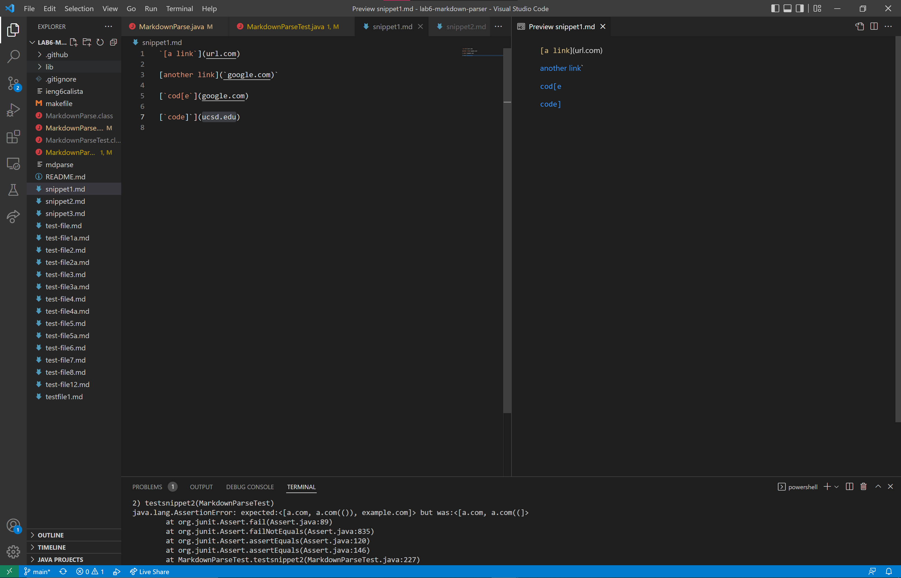
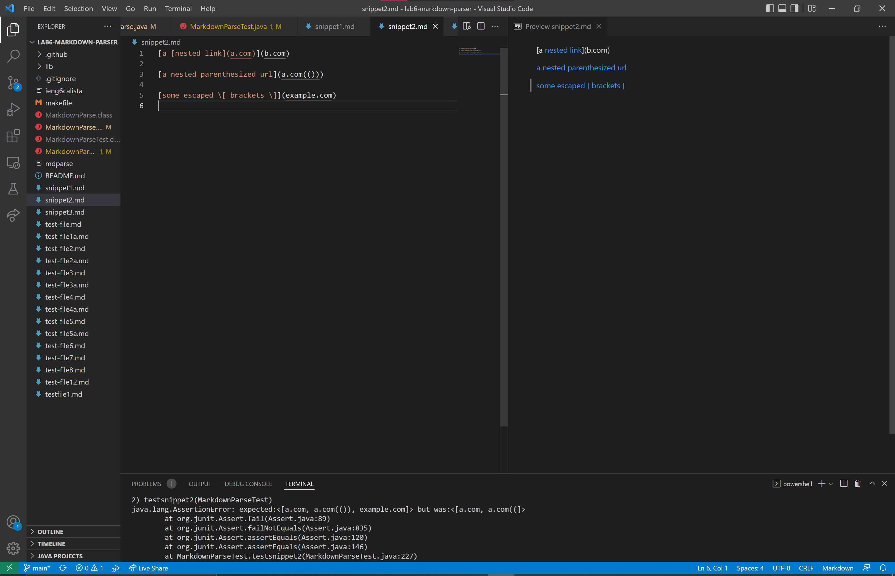
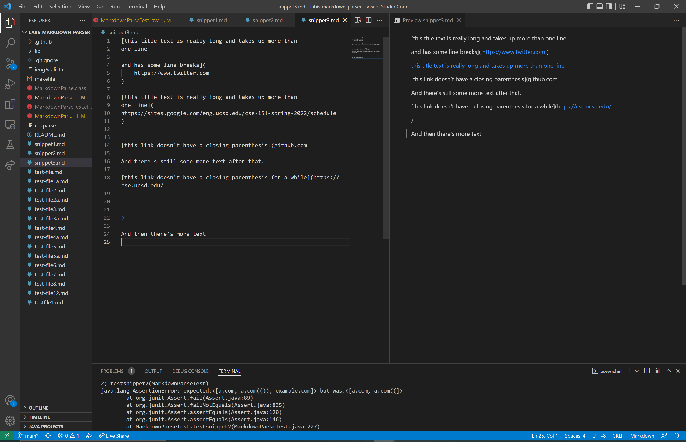
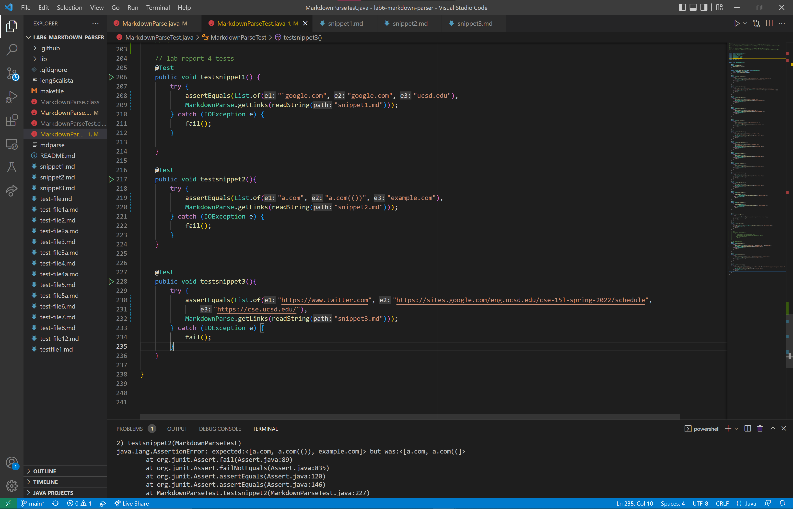
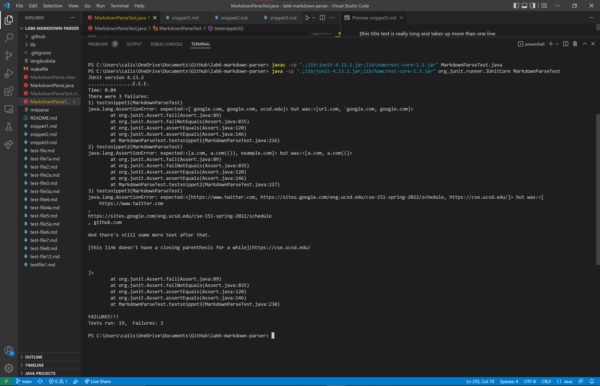

# Week 8 Lab Report

**A link to your markdown-parse repository and a link to the one you reviewed in week 7:**

* [My repository](https://github.com/calistajlee/lab6-markdown-parser)
* [The repository I reviewed](https://github.com/calistajlee/markdown-parse-peer-review)
---

**For each test above:**

* **Decide on what it should produce (i.e., expected output) by using either VScode preview or the CommonMark demo site**
**Showing the code in MarkdownParseTest.java for how you turned it into a test**

These pictures show the expected output in VS Code.
Snippet 1:

Snippet 2:

Snippet 3:

This is my code in MarkdownParseTest.java and it shows how I turned it into JUnit tests.

* **For your implementation, the corresponding output when running the tests; if it passed, say so. If it didn’t pass, show the specific part of the JUnit output that shows the test failure.**
**For the implementation you reviewed in Week 7, the corresponding output when running the tests; if it passed, say so. If it didn’t pass, show the specific part of the JUnit output that shows the test failure.**

For my implementation, this is the corresponding output when running the tests. It failed all three tests.

For the implementation in Week 7, this is the corresponding output when running the tests. It failed all three tests.

---

**Answer the following questions with 2-3 sentences each:**

* **Do you think there is a small (<10 lines) code change that will make your program work for snippet 1 and all related cases that use inline code with backticks? If yes, describe the code change. If not, describe why it would be a more involved change.**

* **Do you think there is a small (<10 lines) code change that will make your program work for snippet 2 and all related cases that nest parentheses, brackets, and escaped brackets? If yes, describe the code change. If not, describe why it would be a more involved change.**

* **Do you think there is a small (<10 lines) code change that will make your program work for snippet 3 and all related cases that have newlines in brackets and parentheses? If yes, describe the code change. If not, describe why it would be a more involved change.**