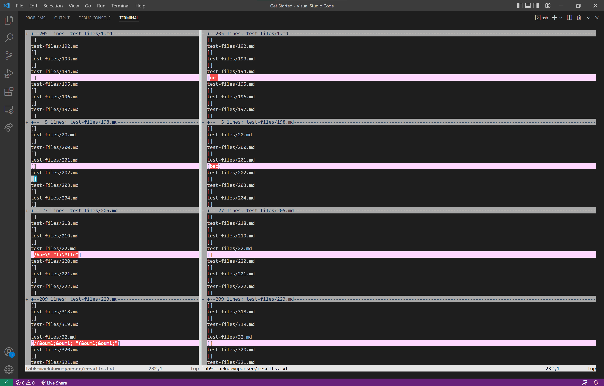

# Week 10 Lab Report

**Explain:** 

* **How you found the tests with different results (Did you use `vimdiff` on the results of running a bash for loop? Did you search through manually? Did you use some other programmatic idea?)**
I ran the command `bash script.sh > results.txt` for my markdownparse file and for the markdownparse file given in lab 9. This put put all the results after running `script.sh` into a text file called `results.txt`. I did this using output redirection, which put all the results after running a command into a text file. To find the tests with different results, I used `vimdiff` to compare `results.txt` line by line and show the differences between finals. The command I used was `vimdiff lab6-markdown-parser/results.txt lab9-markdownparser/results.txt`.

* **Provide a link to the test-file with different-results (in the provided repository or your repository , either is fine)**
1. [Link to test #1 that failed: test-files/201.md](https://github.com/nidhidhamnani/markdown-parser/blob/main/test-files/201.md)
2. [Link to test #2 that failed: test-files/22.md](https://github.com/nidhidhamnani/markdown-parser/blob/main/test-files/22.md)

---
**test-files/201.md**

* **Describe which implementation is correct, or neither if both give the wrong output**

* **Indicate both actual outputs (provide screenshots) and also what the expected output is (list the links that are expected in the output).**

* **What it should produce**

---
**test-files/22.md**

* **Describe which implementation is correct, or neither if both give the wrong output**

* **Indicate both actual outputs (provide screenshots) and also what the expected output is (list the links that are expected in the output).**

* **What it should produce**

