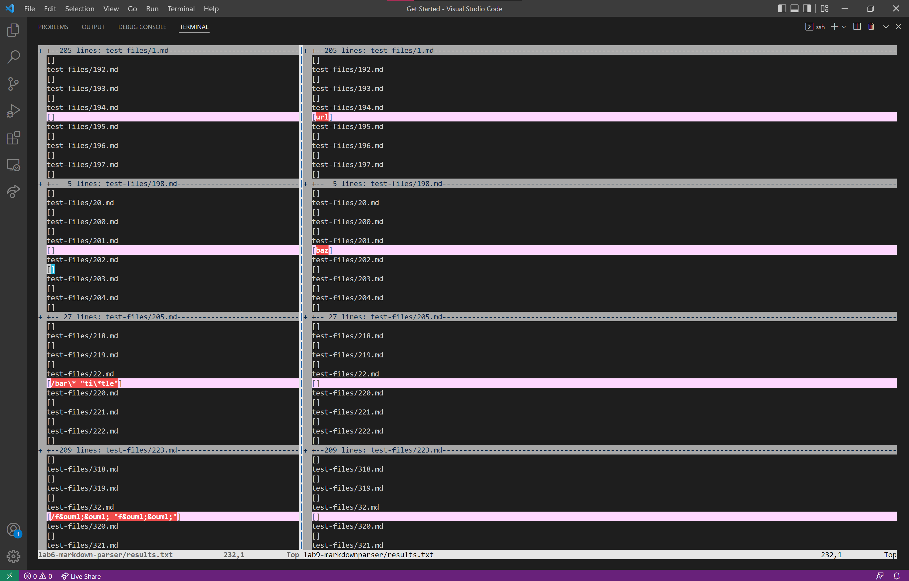
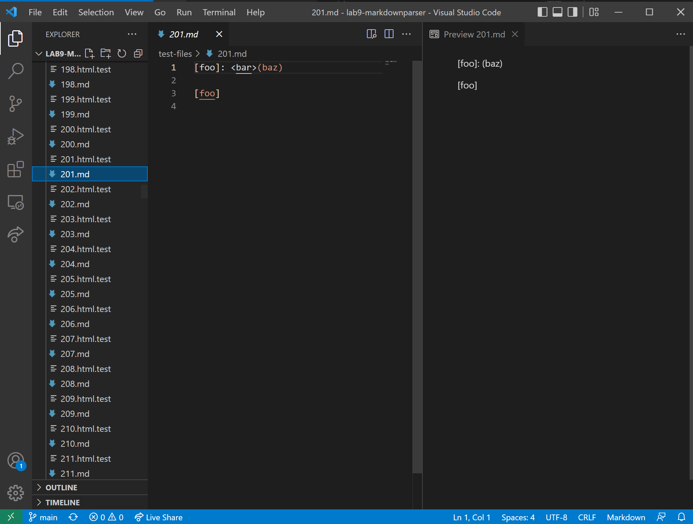
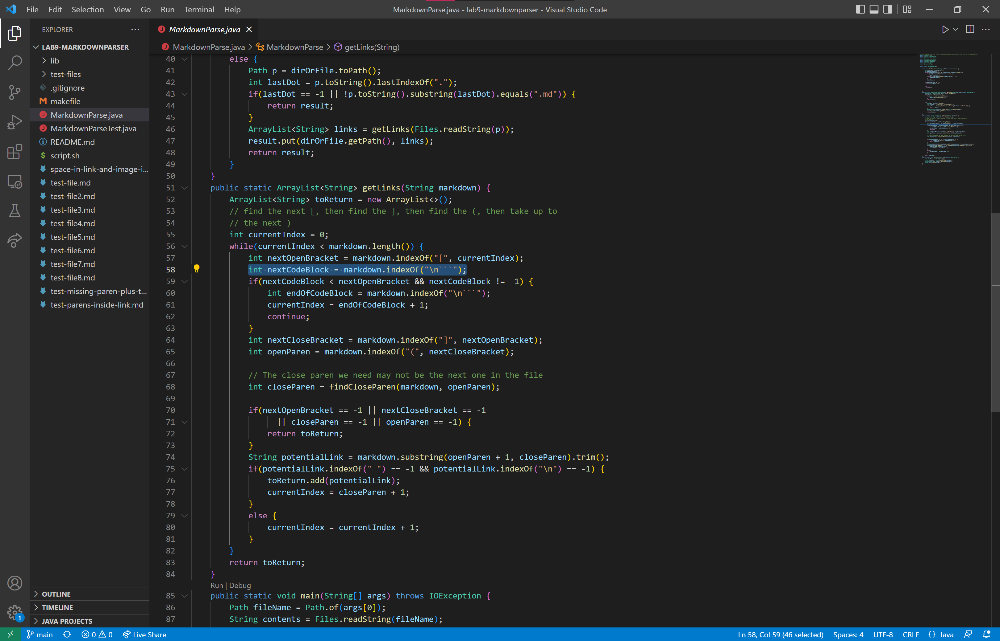
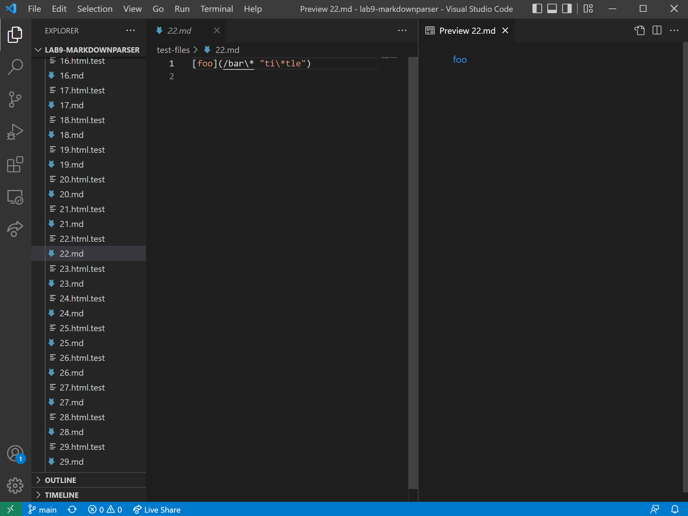
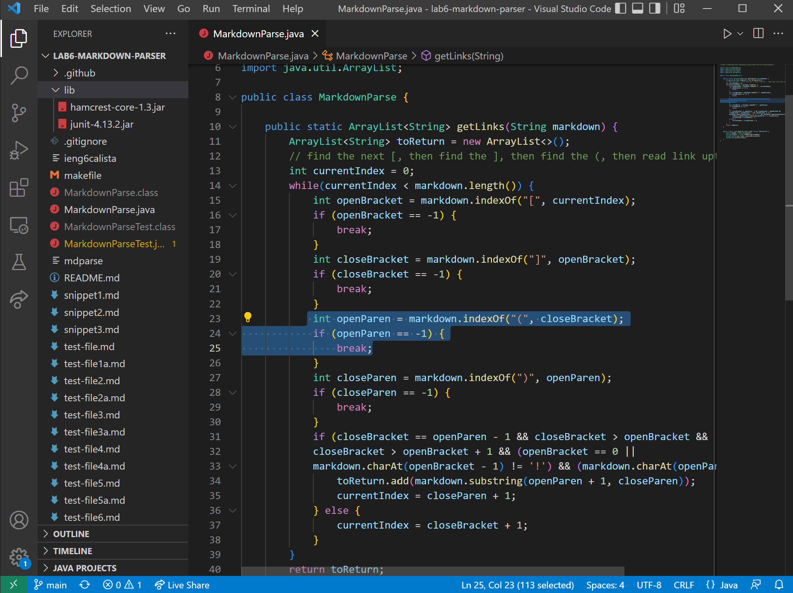

# Week 10 Lab Report

**Explain:** 

* **How you found the tests with different results (Did you use `vimdiff` on the results of running a bash for loop? Did you search through manually? Did you use some other programmatic idea?)**

I ran the command `bash script.sh > results.txt` for my markdownparse file and for the markdownparse file given in lab 9. This put put all the results after running `script.sh` into a text file called `results.txt`. I did this using output redirection, which put all the results after running a command into a text file. To find the tests with different results, I used `vimdiff` to compare `results.txt` line by line and show the differences between finals. The command I used was `vimdiff lab6-markdown-parser/results.txt lab9-markdownparser/results.txt`.

* **Provide a link to the test-file with different-results (in the provided repository or your repository , either is fine)**

1. [Link to test #1 that failed: test-files/201.md](https://github.com/nidhidhamnani/markdown-parser/blob/main/test-files/201.md)
2. [Link to test #2 that failed: test-files/22.md](https://github.com/nidhidhamnani/markdown-parser/blob/main/test-files/22.md)

---
**test-files/201.md**

* **Describe which implementation is correct, or neither if both give the wrong output**

My implementation in my markdown file is correct. In the given markdownparse file, the implementation is incorrect. As you can see in the pictures below, the given markdown parser file's actual output does not match the expected output as there are no links in the output.

* **Indicate both actual outputs (provide screenshots) and also what the expected output is (list the links that are expected in the output).**

Actual output:

Expected output:

* **For the implementation that’s not correct (or choose one if both are incorrect), describe the bug (the problem in the code) in about 2-3 sentences. You don’t have to provide a fix, but you should be specific about what is wrong with the program, and show the code that should be fixed (Provide a screenshot of code and highlight where the change needs to be made).**

Using the given markdownparse file, the bug is that there is no check to see if there is anything else besides new lines inbetween the closing bracket and the opening parentheses. We should check for other characters inbetween [] and (), which invalidates any possible link. There should also be a check to see if whatever is inside the () is a valid link. If it is a valid link, there should be a correct domain after the website name in the link.

---
**test-files/22.md**

* **Describe which implementation is correct, or neither if both give the wrong output**

Neither implementation in my markdownparser file or the given markdownparse file is correct. As you can see in the pictures below, both files' actual outputs do not match the expected output.

* **Indicate both actual outputs (provide screenshots) and also what the expected output is (list the links that are expected in the output).**

Actual output:

Expected output:

* **For the implementation that’s not correct (or choose one if both are incorrect), describe the bug (the problem in the code) in about 2-3 sentences. You don’t have to provide a fix, but you should be specific about what is wrong with the program, and show the code that should be fixed (Provide a screenshot of code and highlight where the change needs to be made).**

Using my markdownparse file, the bug is that program doesn't recognize that this is a valid link. There needs to be a check to see if the characters inside the () form a valid link. A valid link would have a proper domain without spaces.

