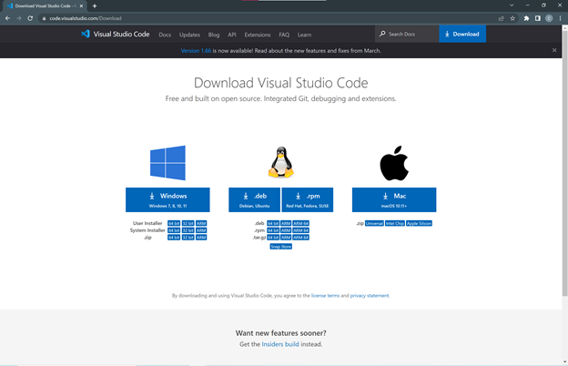
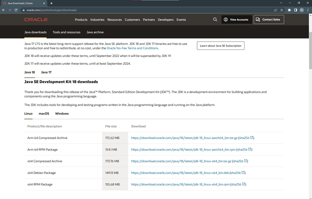
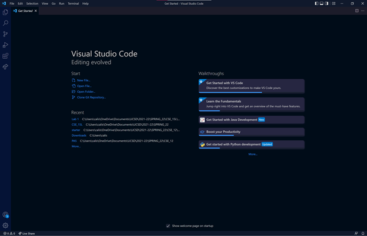

# Week 4 Lab Report

---
## Installing VS Code
To set up VS Code (a programming environment), go to the [download page](https://code.visualstudio.com/download) and click “Download” in the upper right corner. Download VS Code corresponding to your operating system (OS). Additionally, you must have Java downloaded on your computer. To do this, go to this [download page](https://www.oracle.com/java/technologies/downloads/) and download the Java Development Kit (JDK) according to your OS. Download both VS Code and and Java according to the default settings. 

*This is the website to download VS Code.*

*This is the website to download Java.*

*This is what VS Code should look similar to this after you download it.*

---
